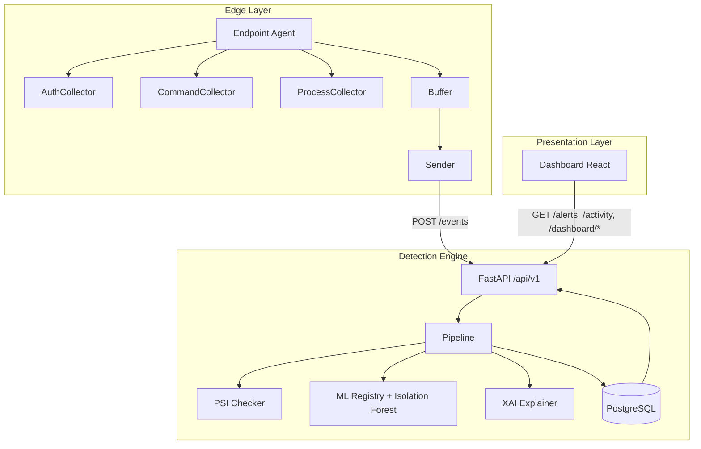
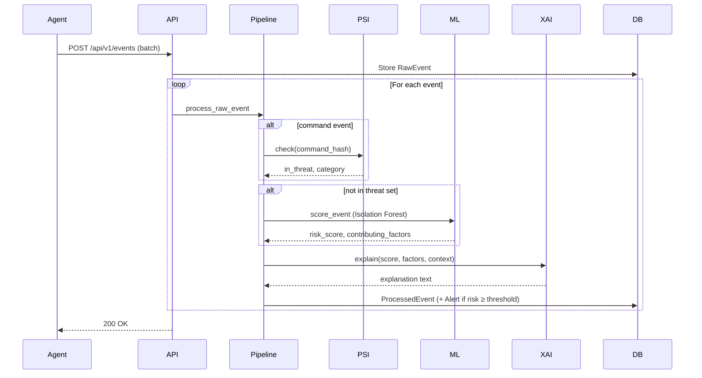

# Threat Detection System — Architecture

This document describes the architecture, components, layers, features, and novelty of the Threat Detection System.

---

## Table of Contents

1. [High-Level Architecture](#high-level-architecture)
2. [Architecture Diagram](#architecture-diagram)
3. [Component Overview](#component-overview)
4. [Layers](#layers)
5. [Detection Layer (Detailed)](#detection-layer-detailed)
6. [Data Flow](#data-flow)
7. [Components in Detail](#components-in-detail)
8. [Features](#features)
9. [Novelty & Design Decisions](#novelty--design-decisions)
10. [Technology Stack](#technology-stack)

---

## High-Level Architecture

The system is a **full-stack threat detection platform** that:

- **Collects** activity from Linux endpoints (auth logs, shell commands as hashes only, process snapshots).
- **Analyzes** events with privacy-preserving threat lookup (PSI), unsupervised anomaly detection (Isolation Forest), and explainable AI (XAI).
- **Surfaces** alerts and risk scores in a web dashboard with filtering and charts.

There are three main subsystems:

| Subsystem | Role |
|-----------|------|
| **Endpoint Agent** | Runs on Linux hosts; collects and buffers events; sends only command hashes (never raw commands) to the engine. |
| **Detection Engine** | FastAPI service: ingests events, runs PSI → ML → XAI pipeline, persists raw/processed events and alerts in PostgreSQL. |
| **Web Dashboard** | React + TypeScript + Vite UI: alerts list/detail, activity timeline, dashboard stats and charts; reads from engine API. |

---

## Architecture Diagram

### System Context

```
┌─────────────────────────────────────────────────────────────────────────────────────────┐
│                              THREAT DETECTION SYSTEM                                      │
├─────────────────────────────────────────────────────────────────────────────────────────┤
│                                                                                          │
│   ┌─────────────────┐         POST /api/v1/events          ┌─────────────────────────┐  │
│   │  Linux host(s)   │ ───────────────────────────────────► │   Detection Engine      │  │
│   │                  │   (batched events, Bearer token)     │   (FastAPI)             │  │
│   │  • Auth log      │                                      │                         │  │
│   │  • Bash history  │                                      │  Ingest → PSI → ML →   │  │
│   │  • Process list  │                                      │  XAI → Store / Alert   │  │
│   │                  │                                      └───────────┬─────────────┘  │
│   │  Agent           │                                                  │                │
│   └─────────────────┘                                                  │                │
│                                                                         ▼                │
│   ┌─────────────────┐     GET /api/v1/alerts, /activity,     ┌─────────────────────────┐  │
│   │  Web Dashboard   │ ◄──────────────────────────────────── │   PostgreSQL            │  │
│   │  (React + Vite)  │     /dashboard/*                       │   + model file          │  │
│   │                  │                                       │   (global_model.joblib) │  │
│   │  Alerts, Activity│                                       └─────────────────────────┘  │
│   │  Stats, Charts   │                                                                     │
│   └─────────────────┘                                                                     │
│                                                                                          │
└─────────────────────────────────────────────────────────────────────────────────────────┘
```

### Engine Request Path (Event Ingestion)

```
POST /api/v1/events
        │
        ▼
┌───────────────────┐     ┌───────────────────┐     ┌───────────────────┐
│  Validate (schema) │ ──► │  Persist RawEvent  │ ──► │  Pipeline (each)   │
│  EventIn[]         │     │  in PostgreSQL    │     │  event             │
└───────────────────┘     └───────────────────┘     └─────────┬─────────┘
                                                               │
        ┌─────────────────────────────────────────────────────┼─────────────────────────────────────────────────────┐
        │                                                     ▼                                                      │
        │  ┌─────────────┐    ┌─────────────┐    ┌─────────────┐    ┌─────────────┐    ┌─────────────────────────┐  │
        │  │ PSI Check   │    │ Ensure      │    │ ML Score    │    │ XAI         │    │ Store ProcessedEvent     │  │
        │  │ (command_   │ ─► │ global      │ ─► │ (Isolation  │ ─► │ (explain)   │ ─► │ + Alert if risk ≥       │  │
        │  │  hash only) │    │ model       │    │  Forest)    │    │             │    │   threshold             │  │
        │  └─────────────┘    └─────────────┘    └─────────────┘    └─────────────┘    └─────────────────────────┘  │
        │                                                                                                            │
        └────────────────────────────────────────────────────────────────────────────────────────────────────────────┘
```

### Mermaid: Component Diagram



### Mermaid: Pipeline Sequence



### Layered View

```
┌─────────────────────────────────────────────────────────────────────────────────────────┐
│  PRESENTATION LAYER                                                                      │
│  • Web Dashboard (React, TypeScript, Vite, Recharts)                                      │
│  • Pages: Dashboard, Alerts, Activity, AlertDetail                                        │
│  • Components: RiskBadge, AlertCard, FiltersBar, TimelineStrip, ExplanationBlock         │
└─────────────────────────────────────────────────────────────────────────────────────────┘
                                        │
                                        │ HTTP (GET /api/v1/*)
                                        ▼
┌─────────────────────────────────────────────────────────────────────────────────────────┐
│  API LAYER                                                                                │
│  • FastAPI app (engine/main.py)                                                           │
│  • Routes: /api/v1/events, /alerts, /activity, /admin/threat-hashes, /dashboard/*         │
│  • Auth: optional require_api_key (Bearer)                                                 │
│  • Schemas: Pydantic request/response (api/schemas.py)                                     │
└─────────────────────────────────────────────────────────────────────────────────────────┘
                                        │
                                        ▼
┌─────────────────────────────────────────────────────────────────────────────────────────┐
│  BUSINESS / DETECTION LAYER                                                               │
│  • Pipeline (pipeline.py): PSI → ML → XAI → store                                         │
│  • PSI (psi/checker.py): threat-hash membership (DB + file)                               │
│  • ML (ml/): features.py, model.py (Isolation Forest), registry.py (load/save/score)      │
│  • XAI (xai/explainer.py): human-readable explanation from score + factors + context      │
└─────────────────────────────────────────────────────────────────────────────────────────┘
                                        │
                                        ▼
┌─────────────────────────────────────────────────────────────────────────────────────────┐
│  DATA LAYER                                                                               │
│  • SQLAlchemy ORM (models/): RawEvent, ProcessedEvent, Alert, ThreatHash, Machine, User   │
│  • PostgreSQL (or SQLite in tests); Alembic migrations                                    │
│  • File: data/models/global_model.joblib, data/threat_hashes.txt                           │
└─────────────────────────────────────────────────────────────────────────────────────────┘

┌─────────────────────────────────────────────────────────────────────────────────────────┐
│  EDGE / COLLECTION LAYER (separate process)                                               │
│  • Agent (agent/): Collectors (Auth, Command, Process) → Buffer → Sender                  │
│  • Config: config.yaml + env (AGENT_*); optional systemd unit                             │
└─────────────────────────────────────────────────────────────────────────────────────────┘
```

---

## Component Overview

| Component | Location | Responsibility |
|-----------|----------|----------------|
| **Endpoint Agent** | `agent/` | Collect auth, command (hashed only), and process data; buffer; send to engine with retry/backoff. |
| **Detection Engine** | `engine/` | Ingest events, run PSI/ML/XAI pipeline, persist events and alerts, serve REST API. |
| **Web Dashboard** | `dashboard/` | React UI for alerts, activity timeline, dashboard stats and charts. |
| **Shared** | `shared/` | Unified event JSON schema and command-hash normalization (agent + engine alignment). |
| **Data / Scripts** | `data/`, `scripts/` | Threat hashes file, persisted ML model, seed/demo/force-model scripts. |

---

## Layers

### 1. Presentation Layer

- **Where:** `dashboard/src/`
- **What:** React + TypeScript + Vite SPA.
- **Responsibilities:** Render dashboard overview, alerts list/detail, activity timeline; filters (machine, user, time, risk); risk badges, explanation blocks, Recharts (alerts over time, by technique, top agents, evolution). API client in `api/client.ts` calls engine `/api/v1/*`.

### 2. API Layer

- **Where:** `engine/main.py`, `engine/api/`
- **What:** FastAPI application, routers, Pydantic schemas, optional API-key dependency.
- **Responsibilities:** Validate request bodies (e.g. `EventIn[]`), delegate to pipeline or DB queries, return JSON. Routes: `POST/GET /events`, `GET /alerts`, `GET /activity`, `GET /events`, `POST/GET /admin/threat-hashes`, `GET /dashboard/stats`, `/alerts-over-time`, `/alerts-by-technique`, `/top-agents`, `/alerts-evolution-by-agent`. Health at `GET /health` (no auth).

### 3. Business / Detection Layer

- **Where:** `engine/pipeline.py`, `engine/psi/`, `engine/ml/`, `engine/xai/`
- **Responsibilities:**
  - **Pipeline:** For each raw event: if command, run PSI; if not in threat set, ensure global Isolation Forest is fitted (from DB or disk), score event, get contributing factors; run XAI to build explanation; persist `ProcessedEvent`; create `Alert` if risk ≥ threshold.
  - **PSI:** Maintain threat-hash set (DB + file); answer membership for `command_hash`; no raw command on server.
  - **ML:** Feature extraction from event (hour, dow, source, buckets, command_length_norm); Isolation Forest; registry loads/saves global model, fits when enough events (e.g. ≥30), returns risk 0–100 and contributing factors.
  - **XAI:** Produce short, human-readable explanation (PSI hit vs anomaly severity + factors + risk score).

### 4. Data Layer

- **Where:** `engine/db/`, `engine/models/`, `engine/db/migrations/`
- **What:** SQLAlchemy engine/session, ORM models, Alembic migrations.
- **Entities:** Machine, User, RawEvent, ProcessedEvent, Alert, ThreatHash. Persisted artifact: `data/models/global_model.joblib` (Isolation Forest); optional `data/threat_hashes.txt`.

### 5. Edge / Collection Layer

- **Where:** `agent/`
- **What:** Standalone Python process (or systemd service).
- **Responsibilities:** AuthCollector (auth log/journalctl), CommandCollector (shell history → normalize → hash only), ProcessCollector (process snapshot); buffer (in-memory, optional file persist); sender (HTTP POST with retry/backoff). No local DB; config via `config.yaml` and env.

---

## Detection Layer (Detailed)

The **Detection Layer** (also called the Business/Detection Layer) is the core of the threat detection system. It lives under `engine/` and is responsible for: (1) checking command hashes against a known-threat set (PSI), (2) scoring non-threat events with an unsupervised anomaly model (ML), and (3) generating human-readable explanations (XAI). The **Pipeline** orchestrates these steps and writes results to the database.

### Role in the Stack

- **Input:** A single `RawEvent` (already persisted by the API layer).
- **Output:** A `ProcessedEvent` (risk score, explanation, contributing factors, model version) and optionally an `Alert` if risk is above the configured threshold.
- **Dependencies:** Database session (for RawEvent/ThreatHash queries and model training data), PSI checker instance, and the global ML registry.

---

### 1. Pipeline (`engine/pipeline.py`)

The pipeline is the **orchestrator** of the detection layer. It runs once per raw event and decides which detectors to apply and in what order.

#### Responsibilities

- **Branching logic:** Only **command** events are sent to the PSI checker (auth and process events skip PSI).
- **PSI-first:** If the event is a command and has a `command_hash`, the pipeline calls `psi.check(command_hash)`. If the hash is in the threat set, the event is treated as **known malicious**: risk is set to **100**, contributing factors to `["known_malicious_command", category]`, and the ML step is **skipped**.
- **ML path:** If the event is **not** in the threat set (or is not a command), the pipeline ensures the global Isolation Forest model exists (load from disk or fit from DB), then calls `registry.score_event(event_dict)` to get a risk score (0–100) and contributing factors.
- **XAI:** Regardless of path (PSI hit or ML), the pipeline calls `explain(risk_score, in_threat, contributing_factors, source, event_context)` to produce the final explanation string.
- **Persistence:** It creates a `ProcessedEvent` with `raw_event_id`, risk, explanation, factors, and `model_version` (`psi_v1` for PSI hits, `iforest_v1` for ML). If `risk_score >= ENGINE_ALERT_THRESHOLD` (default 50), it also creates an `Alert` linked to that processed event.

#### Key functions

| Function | Purpose |
|----------|---------|
| `process_raw_event(db, raw, psi)` | Main entry: runs PSI (if command) → ML (if not in threat) → XAI → store ProcessedEvent and optionally Alert. |
| `_ensure_global_model(db)` | Load global model from `data/models/global_model.joblib`, or fit from the latest 500 RawEvents if fewer than 30 samples; then save to disk. |
| `get_psi_checker(db)` | Builds a `PSIChecker` with hashes from the `ThreatHash` table and from the file at `ENGINE_THREAT_DB_PATH`. |
| `get_registry()` | Returns the singleton `ModelRegistry` (model_dir=`data/models`, min_samples_to_fit=30). |

---

### 2. PSI — Privacy-Preserving Threat Check (`engine/psi/checker.py`)

**PSI** here means checking whether a **command hash** is in a **threat set** without the server ever seeing the raw command. Only the agent sees the command; it normalizes and hashes it; the engine only sees the hash.

#### Class: `PSIChecker`

- **Constructor:** `PSIChecker(threat_hashes=None, path=None)`. `threat_hashes` is a set of SHA-256 hashes (e.g. from the DB). `path` is an optional file path (e.g. `data/threat_hashes.txt`) from which to load additional hashes.
- **File format:** One hash per line; leading/trailing whitespace stripped; empty lines and lines starting with `#` are ignored.
- **Method `check(command_hash)`:** Returns `(in_threat_set: bool, category: Optional[str])`. The category is currently always `None` unless extended (e.g. from DB per-hash metadata).
- **Method `reload_from_db(db_hashes)`:** Replaces the in-memory set with the given set and re-loads from the file if `path` is set. Used when the threat set is updated.

#### Data sources

- **Database:** All rows from `ThreatHash.command_hash` are passed in when building the checker (in the pipeline, via `get_psi_checker(db)`).
- **File:** Configured by `ENGINE_THREAT_DB_PATH` (default `data/threat_hashes.txt`). Hashes from the file are merged with DB hashes.

#### Design notes

- No raw command text is ever stored or compared on the server; only hashes are used. Agent and engine share the same normalization (strip, collapse whitespace, lowercase) before hashing so that the same command always yields the same hash.

---

### 3. ML — Anomaly Detection (`engine/ml/`)

The ML subsystem scores events that are **not** in the PSI threat set using a **global Isolation Forest** and produces a 0–100 risk score plus **contributing factors** for explainability.

#### 3.1 Feature extraction (`engine/ml/features.py`)

Events are converted to a **fixed-size numeric vector** used for both training and inference.

- **`extract_features(event, payload=None)`**  
  Builds a 1-D float vector from an event dict. Uses:
  - **Time:** `hour` (0–1), `dow` (day-of-week 0–1).
  - **Source:** One of `auth` (0.0), `command` (0.33), `process` (0.66), else 0.5.
  - **Payload-derived (bucketed):** `command_hash` → bucket in [0, 500) then normalized; `exe` → bucket in [0, 200); `action` (auth) → bucket in [0, 20); `user` → bucket in [0, 100); `machine_id` → bucket in [0, 50). Bucketing is via `_hash_bucket(s, n)` = `SHA256(s) % n` then divided by the bucket count so values are in [0, 1].
  - **Command length:** `min(command_length / 500, 1.0)`.

- **`get_feature_names()`**  
  Returns the ordered list of feature names: `hour`, `dow`, `source`, `command_hash_bucket`, `exe_bucket`, `auth_action_bucket`, `user_bucket`, `machine_bucket`, `command_length_norm`.

- **`raw_event_to_dict(raw)`**  
  Converts a `RawEvent` OR a dict into the event-dict shape expected by `extract_features` (e.g. for training from DB rows).

#### 3.2 Model (`engine/ml/model.py`)

- **`AnomalyModel`** wraps scikit-learn’s **Isolation Forest**.
  - **Constructor:** `n_estimators=100`, `contamination=0.05`, `random_state=42`.
  - **`fit(X)`:** Trains the forest (no fit if fewer than 10 samples).
  - **`score(X)`:** Returns `score_samples(X)` — **lower** values mean **more anomalous**.
  - **`risk_scores(X)`:** Maps the anomaly score to **0–100 risk** via `_anomaly_to_risk`. The mapping uses a typical range (e.g. -0.6 to -0.2); more negative (more anomalous) → higher risk.
  - **`save(path)` / `load(path)`:** Persist/load the classifier and `_fitted` flag with joblib.

- **`MODEL_VERSION`** is `"iforest_v1"` and is stored with the serialized model for compatibility checks.

#### 3.3 Registry (`engine/ml/registry.py`)

The **ModelRegistry** owns the **global** Isolation Forest and training statistics used for contributing factors.

- **Constructor:** `model_dir="data/models"`, `min_samples_to_fit=30`.
- **`load_global()`:** Loads from `data/models/global_model.joblib`. Expects `version`, `clf`, `fitted`, `training_mean`, `training_std`. If version mismatches or load fails, returns `False`.
- **`save_global()`:** Writes the current model, version, and training mean/std to the same path.
- **`fit_global(events)`:** Builds feature matrix from a list of event dicts. If `len(events) < min_samples_to_fit`, returns `False`. Otherwise fits the global `AnomalyModel`, sets `_training_mean` and `_training_std` (per-feature; std=0 replaced by 1 to avoid division by zero), and sets `_global_fitted = True`.
- **`score_event(event)`:** For a single event dict: extract features, run through the global model’s `risk_scores`, get one risk in 0–100; then **`_compute_factors(event, features)`** to get contributing factors. Returns `(risk_score, list[str])`.

**Contributing factors** are derived by:

1. Computing **z-scores** of the event’s feature vector against `_training_mean` and `_training_std`.
2. Taking the **top 3** features by absolute z-score (only if z-score ≥ 0.5).
3. Converting each to a short human-readable string via **`_describe_factor`** (e.g. `"hour"` → `"unusual_time_of_day (03:00 UTC)"`, `"user_bucket"` → `"uncommon_user (root)"`, `"exe_bucket"` → `"unusual_executable (/tmp/x)"`, etc.).

So the detection layer not only scores events but also explains **which aspects** of the event (time, user, machine, command hash, exe, auth action, command length) contributed most to the anomaly.

---

### 4. XAI — Explainable AI (`engine/xai/explainer.py`)

The XAI module turns the **risk score**, **PSI result**, and **event context** into a single **human-readable explanation** string stored on each `ProcessedEvent`.

#### Main function: `explain(risk_score, in_threat_set, contributing_factors, event_source, event_context)`

- **If `in_threat_set` is True:**  
  Uses **`_explain_psi`**: returns a CRITICAL message that the user on the given machine executed a command whose hash matches the threat database; optionally includes command hash prefix and command length; recommends immediate investigation.

- **If not in threat set:**  
  - **risk_score &lt; 20:** Returns a short “Normal activity” message with user and machine.
  - **risk_score ≥ 20:** Builds an intro by **severity band:**
    - **≥ 80:** `[HIGH] Highly anomalous activity detected`
    - **≥ 50:** `[MEDIUM] Moderately suspicious activity detected`
    - **≥ 20:** `[LOW] Minor deviation from baseline`
  - Then appends **source-specific details** via **`_build_details`** and a **contributing factors** line (from `_format_factors`), and ends with `Risk score: X/100.`

#### Source-specific details (`_build_details`)

- **Auth:** Failed vs successful login; service; time; for failures, a note about brute-force/credential-stuffing.
- **Command:** Time of execution; if command length &gt; 100, a note about possible obfuscation or encoded payloads.
- **Process:** Exe, PID, time; checks for **suspicious binaries** (e.g. `nc`, `ncat`, `nmap`, `socat`, `curl`, `wget`, `python`, `perl`, `ruby`, `base64`) and adds a post-exploitation/lateral movement note; if exe is under `/tmp`, `/var/tmp`, or `/dev/shm`, adds a note about world-writable directories; if argv contains “miner”/“xmrig”, adds cryptocurrency mining note; if argv has `-e`/`--exec`, adds reverse-shell note.

So the Detection Layer’s XAI component is what makes every alert and processed event **auditable** in plain language, without exposing raw commands (PSI path) or requiring the analyst to interpret raw ML scores.

---

### 5. How the Detection Layer Fits Together

```
                    RawEvent (from DB)
                            │
                            ▼
              ┌─────────────────────────────┐
              │ source == "command" and     │
              │ payload.command_hash?       │
              └─────────────┬───────────────┘
                            │
            ┌───────────────┴───────────────┐
            │ Yes                           │ No (or not command)
            ▼                               ▼
   ┌─────────────────┐            ┌─────────────────┐
   │ PSIChecker      │            │ ModelRegistry    │
   │ .check(hash)    │            │ .score_event()   │
   └────────┬────────┘            └────────┬─────────┘
            │                              │
            │ in_threat?                   │ risk_score, factors
            │ Yes → risk=100,              │
            │ factors=[known_malicious_...]│
            └──────────────┬───────────────┘
                           │
                           ▼
              ┌─────────────────────────────┐
              │ explain(risk, in_threat,    │
              │   factors, source, context) │
              └─────────────┬───────────────┘
                            │
                            ▼
              ┌─────────────────────────────┐
              │ ProcessedEvent + optional   │
              │ Alert (if risk ≥ threshold) │
              └─────────────────────────────┘
```

---

### 6. Configuration Affecting the Detection Layer

| Variable / constant | Where | Effect |
|--------------------|--------|--------|
| `ENGINE_THREAT_DB_PATH` | Engine config | File path for threat hashes merged into PSIChecker. |
| `ENGINE_ALERT_THRESHOLD` | Engine config (default 50) | Risk score ≥ this value creates an `Alert`. |
| `model_dir` | Pipeline / Registry | Directory for `global_model.joblib` (default `data/models`). |
| `min_samples_to_fit` | ModelRegistry (default 30) | Minimum number of events required before fitting the global Isolation Forest from DB. |
| Isolation Forest `contamination` | AnomalyModel (0.05) | Expected proportion of anomalies; influences decision boundary. |
| `_anomaly_to_risk` range | model.py | Maps raw anomaly score to 0–100 risk (sensitive to score distribution). |

---

## Data Flow

1. **Collection:** Agent collectors produce events conforming to `shared/event_schema.json`. Commands are sent as `command_hash` (and optional `command_length`) only.
2. **Ingest:** Dashboard or external client does not send events; agents send batches to `POST /api/v1/events`.
3. **Processing:** Engine validates payload, stores RawEvent, then for each event runs pipeline: PSI (if command) → ML (if not in threat set) → XAI → ProcessedEvent (+ Alert if risk ≥ threshold).
4. **Consumption:** Dashboard (and other clients) call `GET /api/v1/alerts`, `GET /api/v1/activity`, `GET /api/v1/dashboard/*` to display alerts, activity, and charts.

---

## Components in Detail

### Endpoint Agent (`agent/`)

| Module | File(s) | Description |
|--------|---------|-------------|
| **AuthCollector** | `collectors/auth.py` | Reads `/var/log/auth.log` or journalctl; emits auth events (login, logout, sudo, failure). |
| **CommandCollector** | `collectors/command.py` | Reads shell history (e.g. `/home/*/.bash_history`); normalizes and hashes commands; emits only `command_hash` (+ optional `command_length`). |
| **ProcessCollector** | `collectors/process.py` | Samples running processes (exe, argv, pid, parent_pid, start_time). |
| **EventBuffer** | `buffer.py` | In-memory buffer; optional persist via `AGENT_PERSIST_PATH`; batches by size/interval. |
| **Sender** | `sender.py` | HTTP POST to engine with optional `Authorization: Bearer`; retries with backoff. |
| **Schema** | `schema.py` | `normalize_command`, `command_hash`, `build_event` aligned with shared schema. |
| **Config** | `config_loader.py` | Loads `config.yaml`; env overrides for endpoint_url, batch_size, send_interval_seconds, etc. |

### Detection Engine (`engine/`)

| Module | File(s) | Description |
|--------|---------|-------------|
| **Events API** | `api/events.py` | `POST /api/v1/events` (ingest batch), `GET /api/v1/events` (list raw). |
| **Alerts API** | `api/alerts.py` | `GET /api/v1/alerts` (query params: machine_id, user, since, until, risk_min, limit). |
| **Activity API** | `api/activity.py` | `GET /api/v1/activity` (processed events with risk/explanation). |
| **Admin API** | `api/admin.py` | `POST /api/v1/admin/threat-hashes`, `GET /api/v1/admin/threat-hashes`. |
| **Dashboard API** | `api/dashboard.py` | `GET /api/v1/dashboard/stats`, `/alerts-over-time`, `/alerts-by-technique`, `/top-agents`, `/alerts-evolution-by-agent`. |
| **Auth** | `api/auth.py` | `require_api_key` dependency; when `ENGINE_API_KEY` is set, `/api/v1` routes require Bearer token. |
| **Pipeline** | `pipeline.py` | Orchestrates PSI → ML → XAI → store ProcessedEvent; create Alert when risk ≥ threshold. |
| **PSI** | `psi/checker.py` | `PSIChecker`: threat set from DB + file; `check(command_hash)` → (in_threat, category). |
| **ML** | `ml/features.py`, `ml/model.py`, `ml/registry.py` | Features from event; Isolation Forest; registry load/save/fit/score and contributing factors. |
| **XAI** | `xai/explainer.py` | `explain(risk_score, in_threat_set, contributing_factors, ...)` → human-readable string. |
| **DB** | `db/session.py`, `models/*` | SQLAlchemy engine/session; models and migrations. |
| **Config** | `config.py` | Pydantic Settings with `ENGINE_` prefix (database_url, threat_db_path, alert_threshold, api_key, log_level). |

### Web Dashboard (`dashboard/`)

| Area | Path | Description |
|------|------|-------------|
| **API client** | `src/api/client.ts` | Functions for alerts, activity, dashboard stats and chart endpoints. |
| **Pages** | `src/pages/` | Dashboard (overview), Activity (timeline), Alerts (list), AlertDetail. |
| **Components** | `src/components/` | RiskBadge, AlertCard, FiltersBar, TimelineStrip, ExplanationBlock. |
| **Routing** | `App.tsx` | `/`, `/activity`, `/alerts`, `/alerts/:id`. |

### Shared (`shared/`)

| Asset | Path | Description |
|-------|------|-------------|
| **Event schema** | `event_schema.json` | JSON Schema for activity events: event_type, machine_id, user, timestamp, source, payload (auth/command/process). Command events require `command_hash` in payload. |
| **README** | `README.md` | Schema and command-hash normalization (strip, collapse whitespace, lowercase → SHA-256). |

---

## Features

### Privacy-Preserving Command Check (PSI)

- Commands are **never** sent in plain text. The agent normalizes and hashes each command (SHA-256) and sends only `command_hash` (and optional `command_length`).
- The engine checks `command_hash` against a threat set (DB table + optional file `ENGINE_THREAT_DB_PATH`). Normalization (strip, collapse whitespace, lowercase) is shared between agent and engine so hashes match.
- **Benefit:** Server never sees raw commands; privacy-preserving membership check.

### Unsupervised Anomaly Detection (ML)

- For events **not** in the threat set, the engine extracts a fixed-size feature vector (e.g. hour, dow, source, command_hash_bucket, exe_bucket, auth_action_bucket, user_bucket, machine_bucket, command_length_norm).
- A **global Isolation Forest** is fitted when enough events exist (e.g. ≥30), persisted as `data/models/global_model.joblib`.
- Each event is scored (risk 0–100); contributing factors are derived (e.g. from feature deviations). No labels required.

### Explainable AI (XAI)

- Every processed event gets a short explanation:
  - **PSI hit:** e.g. “User X on machine Y executed a command that matches a known malicious hash…”
  - **Anomaly:** Severity (HIGH/MEDIUM/LOW) + contributing factors + risk score; process-specific hints (e.g. suspicious bins, tmp exec, miner-like args) when applicable.

### Alerts

- When `risk_score ≥ ENGINE_ALERT_THRESHOLD` (default 50), an **Alert** is created and stored. Dashboard and APIs list/filter alerts by machine, user, time, risk.

### Dashboard

- **Overview:** KPIs (total events, total alerts, critical alerts, auth success/failure).
- **Charts:** Alerts over time, alerts by technique, top agents, alerts evolution by agent (time range filters).
- **Alerts:** List and detail with risk badge and explanation.
- **Activity:** Timeline of processed events with risk and explanation; filters (machine, user, time, risk); optional auto-refresh.

### Agent Resilience

- **Buffer:** In-memory with optional file persist (`AGENT_PERSIST_PATH`) so events survive restarts.
- **Batching:** Send by batch size or interval (configurable).
- **Sender:** Retry with backoff on HTTP failure. Optional `Authorization: Bearer` for API-key auth.

---

## Novelty & Design Decisions

### 1. Privacy by Design (PSI for Commands)

- **Novelty:** Command content never leaves the endpoint in plain form. Only hashes are sent; the server performs set membership (threat list) without learning command text. Same normalization on agent and engine ensures consistent hashing.
- **Design:** Keeps analyst and server from seeing sensitive commands while still enabling threat matching.

### 2. Unsupervised ML (No Labels)

- **Novelty:** No labeled “malicious” dataset required. Isolation Forest learns baseline from ingested events; deviations get higher risk. Model is fitted once enough events exist and persisted for reuse.
- **Design:** Suitable for deployment where labels are scarce; focuses on “different from normal” rather than known signatures only.

### 3. Explainable Outputs (XAI)

- **Novelty:** Every processed event has a human-readable explanation (PSI hit vs anomaly, severity, contributing factors, risk score). Process and auth context can add concrete hints (e.g. failed logins, suspicious paths).
- **Design:** Supports analyst triage and trust in the system without opening the ML black box.

### 4. Unified Event Schema

- **Novelty:** Single JSON schema (`shared/event_schema.json`) for auth, command, and process events. Agent and engine share it; command events are defined by `command_hash` in payload.
- **Design:** Simplifies validation, evolution, and cross-component consistency.

### 5. Layered Detection (PSI + ML)

- **Novelty:** Deterministic threat lookup (PSI) first; only non-matches go through ML. PSI hits get fixed high risk (e.g. 100) and dedicated explanation; ML handles “unknown” behavior.
- **Design:** Combines known-bad (hash list) with unknown-bad (anomaly) in one pipeline.

### 6. Edge Buffering and Resilience

- **Novelty:** Agent buffers events and can persist to file; batches and retries reduce dependency on engine availability.
- **Design:** Suitable for unreliable networks or brief engine outages.

---

## Technology Stack

| Layer / Component | Technologies |
|-------------------|-------------|
| **Agent** | Python 3.10+, PyYAML, httpx, psutil |
| **Engine** | FastAPI, Uvicorn, Pydantic, SQLAlchemy, PostgreSQL (or SQLite in tests), Alembic, scikit-learn (Isolation Forest), NumPy, joblib |
| **Dashboard** | React, TypeScript, Vite, React Router, Recharts, Tailwind CSS |
| **Infrastructure** | Docker, Docker Compose (Postgres, engine, dashboard); optional systemd for agent |
| **Shared** | JSON Schema (`event_schema.json`), agreed normalization (Python) |

---

## Summary

The Threat Detection System is a **three-tier** architecture: **Agent** (edge collection with privacy-preserving command hashing), **Engine** (ingest, PSI, ML, XAI, persistence, REST API), and **Dashboard** (React UI for alerts, activity, and analytics). Layers are **Presentation → API → Business/Detection → Data**, with the **Edge/Collection** layer running as a separate process. **Novelty** centers on **PSI for command privacy**, **unsupervised anomaly detection**, **explainable outputs**, a **unified event schema**, and **resilient edge buffering**. For setup, configuration, and API details, see the main [README.md](README.md).
